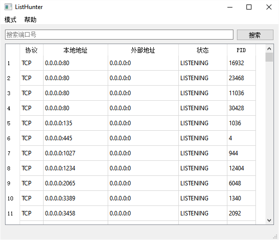
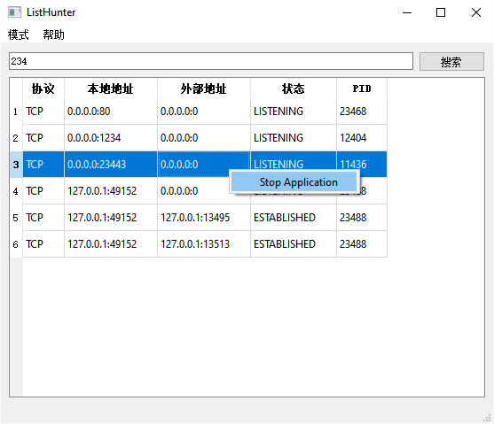

ListHunter
===

一个完全基于命令行与正则表达式的操作工具。

可按指定关键词使用命令行进行搜索，并进行相应的操作。如搜索8080端口并终止进程。

更换不同的配置模式，可用于执行不同的操作，甚至跨平台。

---

默认配置（modes文件夹里）已支持：

- 搜索端口，强制关闭进程
- 搜索程序，强制关闭进程


# 截图






---

# 模式

每一个模式的配置都为 JSON 格式，以下为 Windows 下搜索端口的示例：

```json
{
    "placeholder": "搜索端口号", // 搜索框中显示的提示
    "search_types": [ // 根据搜索框的格式，使用不同的命令行搜索
        // 关键词为数字，为搜索端口
        {
            "key_exp": "^(\\d+)$", // 满足这个纯数字的表达式时
            "search_exp": "netstat -ano | findstr %1" // 执行搜索指定端口的命令行
        },
        // 关键词为空，为搜索全部
        {
            "key_exp": "^$",
            "search_exp": "netstat -ano" // 执行搜索全部端口的命令行
        }
    ],
    // 搜索结果的标题；搜索结果的列数
    "result_titles": [
        "协议",
        "本地地址",
        "外部地址",
        "状态",
        "PID"
    ],
    // 处理搜索结果的每一行
    "result_lines": [
        // 匹配格式：TCP    0.0.0.0:5520           0.0.0.0:0              LISTENING       24536
        {
            "expression": "^\\s*(\\w+)\\s+([\\d\\.:]+)\\s+([\\d\\.:]+)\\s+(\\w+)\\s+(\\d+)\\s*$",
            "actions": [
                {
                    "name": "Stop Application", // 动作名字
                    "exp": "", // 不为空则替换上面的expression的匹配结果；会继续影响后面action的参数
                    "cmd": "taskkill /pid %5 /f", // 动作命令行，%1、%2等会替换为正则捕获组
                    "refresh": true // 执行操作后，刷新搜索结果
                }
            ]
        },
        // 匹配格式：TCP    [::]:5520              [::]:0                 LISTENING       24536
        {
            "expression": "^\\s*(\\w+)\\s+([\\d\\.:]+)\\s+([\\*:]+)\\s+(\\d+)\\s*$",
            "ignore": true // 忽略这一行
        }
    ]
}
```

